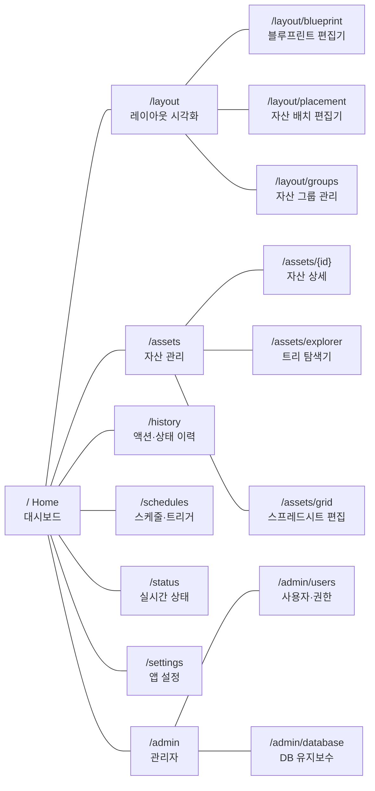
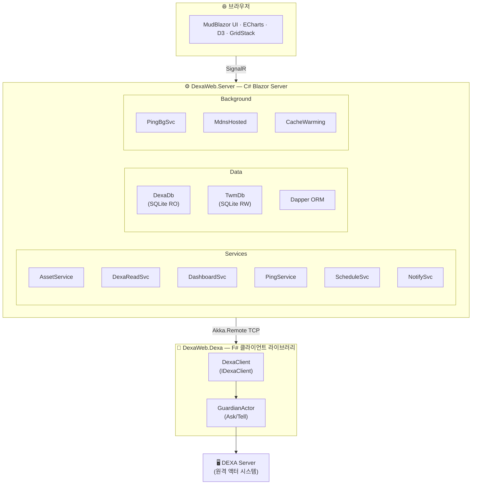
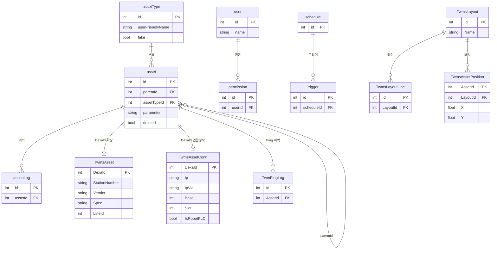

<div align="center">

# TWMS 2.0

**Total Workshop Management System**

종합설비관리 시스템

[](https://dotnet.microsoft.com/)
[](https://dotnet.microsoft.com/apps/aspnet/web-apps/blazor)
[](https://getakka.net/)
[](https://mudblazor.com/)
[](https://www.sqlite.org/)

---

*제조 라인의 설비 자산을 통합 관리·모니터링하는 웹 애플리케이션*
*DEXA 서버와 Akka.NET 원격 통신 및 DEXA SQLite DB 직접 조회로 연동하며,*
*Blazor Server 기반의 실시간 대시보드와 레이아웃 시각화 기능을 제공합니다.*

</div>

---

## 주요 기능

| 기능 | 설명 |
|------|------|
| **대시보드** | KPI 카드, 히트맵, Sankey 차트 등 GridStack 기반 위젯 레이아웃 |
| **자산 관리** | PLC·드라이브·로봇·서보 등 설비 자산 CRUD 및 트리 탐색 |
| **레이아웃 시각화** | SVG 블루프린트 위에 자산 배치·편집 (드래그 앤 드롭) |
| **상태 모니터링** | 백업 상태(BACKEDUP/UNCHANGED/FAILED) 및 실시간 Ping 모니터링 |
| **스케줄/트리거** | Cron 기반 스케줄 관리 및 트리거 빌더 |
| **사용자 관리** | 사용자·권한 관리 (Admin 역할 기반) |
| **mDNS 브로드캐스트** | `twms.local`로 네트워크 내 자동 검색 |

---

## 기술 스택

| 레이어 | 기술 | 용도 |
|--------|------|------|
| 런타임 | .NET 10.0 | 최신 .NET 런타임 |
| 액터 시스템 | Akka.NET 1.4.24 | DEXA 서버와 원격 메시징 |
| UI 프레임워크 | Blazor Server | 서버 사이드 인터랙티브 렌더링 |
| UI 컴포넌트 | MudBlazor 8.15.0 | Material Design 컴포넌트 |
| 데이터베이스 | SQLite + Dapper | 경량 ORM 기반 데이터 접근 |
| 시각화 | ECharts, D3, GridStack | 차트·그래프·반응형 대시보드 레이아웃 |
| 설정 | HOCON, appsettings.json | 계층적 설정 관리 |
| 네이티브 | C++ DLL (DeepPinger) | PLC 경유 네트워크 Ping |
| 언어 | F#, C#, C++ | 타입 안전 백엔드 + UI + 네이티브 성능 |

---

## 프로젝트 구조

```
Twms2.0/
├── src/
│   ├── DexaWeb.Dexa/              # F# — Akka.NET 클라이언트 라이브러리
│   │   ├── Infrastructure/        #   액터 시스템 설정, Guardian, Serializer
│   │   ├── Messages/              #   C2S, S2C, A2S 메시지 정의
│   │   ├── Models/                #   Asset, User, Schedule 등 도메인 모델
│   │   ├── Utilities/             #   mDNS, 에러 처리
│   │   ├── DexaClient.fs          #   메인 클라이언트 (초기화, 재연결)
│   │   └── IDexaClient.fs         #   C# 인터옵용 인터페이스
│   │
│   ├── DexaWeb.Server/            # C# — Blazor Server 웹 애플리케이션
│   │   ├── Components/
│   │   │   ├── Pages/             #   Razor 페이지 (Home, Layout, Assets, ...)
│   │   │   ├── Layout/            #   MainLayout, NavMenu
│   │   │   └── Shared/            #   재사용 컴포넌트
│   │   ├── Services/              #   비즈니스 로직 서비스
│   │   ├── Models/
│   │   │   ├── Dexa/              #   DEXA 도메인 모델
│   │   │   ├── Twm/               #   TWM 로컬 모델
│   │   │   └── Dashboard/         #   대시보드 모델
│   │   ├── Data/                  #   DB 연결 팩토리, 초기화
│   │   ├── HOCON/                 #   HOCON 파라미터 파싱
│   │   ├── wwwroot/               #   정적 자산 (CSS, JS, 이미지)
│   │   ├── Program.cs             #   앱 진입점 및 DI 구성
│   │   └── appsettings.json       #   애플리케이션 설정
│   │
│   ├── DeepPinger/                # C++ — 네이티브 Ping DLL (x64)
│   └── DeepPingerTest/            # C# — DeepPinger 테스트 앱 (WinForms)
│
└── DexaWeb.slnx                   # 솔루션 파일
```

---

## 페이지 구성



---

## 아키텍처



---

## 데이터베이스

### DEXA DB (읽기 전용 — 외부)
DEXA 서버가 관리하는 SQLite 데이터베이스입니다. 경로: `C:\ProgramData\LS\DEXA\Storage\DEXA.sqlite3`

### TWM DB (읽기/쓰기 — 로컬)
TWMS 고유 데이터를 저장하는 로컬 SQLite입니다. 앱 시작 시 자동 생성·마이그레이션됩니다. 경로: `twm.db.sqlite3`



---

## 설정

`appsettings.json` 주요 항목:

```jsonc
{
  "App": {
    "Title": "종합설비관리",              // 앱 타이틀 (배포 환경에 맞게 변경)
    "ShowDate": true,
    "LogoPadding": 13
  },
  "DexaServer": {
    "ServerIp": "YOUR_SERVER_HOST",     // DEXA 서버 주소
    "ServerPort": 50001,                // Akka Remote 포트
    "AskTimeoutSeconds": 30,
    "PingTimeoutSeconds": 5,
    "ClientName": "twm-web"
  },
  "DexaDb": {
    "ConnectionString": "Data Source=C:\\ProgramData\\LS\\DEXA\\Storage\\DEXA.sqlite3;"
  },
  "TwmDb": {
    "ConnectionString": "Data Source=twm.db.sqlite3;"
  },
  "PingSchedule": {
    "IntervalMinutes": 5,               // Ping 주기 (분)
    "Phase1MaxConcurrency": 10          // 동시 Ping 수
  },
  "Mdns": {
    "Hostname": "twms",                 // mDNS 호스트명 (twms.local)
    "Enabled": true
  },
  "Kestrel": {
    "Endpoints": {
      "Http": { "Url": "http://0.0.0.0:80" }
    }
  }
}
```

---

## 빌드 및 실행

### 사전 요구 사항

- [.NET 10.0 SDK](https://dotnet.microsoft.com/download)
- Visual Studio 2022+ (C++ 빌드 도구 포함, DeepPinger DLL 빌드 시 필요)

### 빌드

```bash
cd src
dotnet build DexaWeb.slnx
```

> DeepPinger(C++ DLL)는 MSBuild 타겟에 의해 자동으로 빌드·복사됩니다.

### 실행

```bash
dotnet run --project src/DexaWeb.Server
```

브라우저에서 `http://localhost` 또는 `http://twms.local` (mDNS 활성화 시)로 접속합니다.

---

## 백그라운드 서비스

| 서비스 | 설명 |
|--------|------|
| **PingBackgroundService** | 5분 주기로 전체 자산 Ping 상태 확인 (ICMP + DeepPinger) |
| **MdnsHostedService** | `twms.local` mDNS 브로드캐스트 |
| **캐시 워밍** | 시작 시 자산·액션·에이전트 데이터 사전 로드 |

---

## API 엔드포인트

| 메서드 | 경로 | 설명 |
|--------|------|------|
| GET | `/api/download/backup/{assetId}/{version}` | 백업 ZIP 다운로드 |
| Static | `/report/*` | DEXA 리포트 파일 서빙 |
| Static | `/uploads/*` | 업로드 파일 서빙 |

---

## 라이선스

Private — 내부 사용 전용


## 구현 예정

- QR 페이지
- 레이아웃 및 에디터, 이전 종합설비에서 가져오기 기능 등
- 기종 이름별 매뉴얼(PDF)관리 및 다운로드 제공 기능
