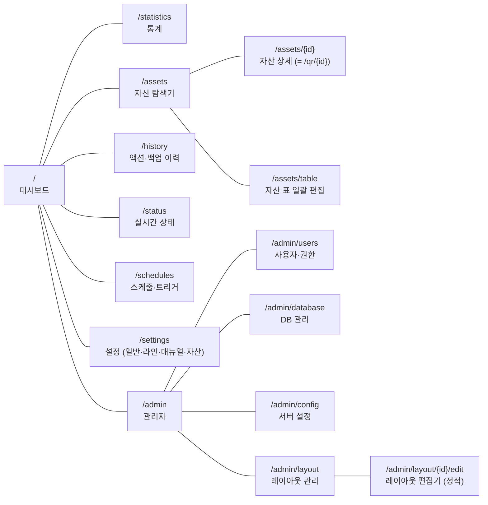
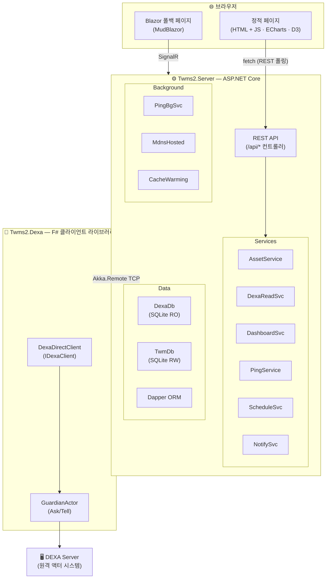
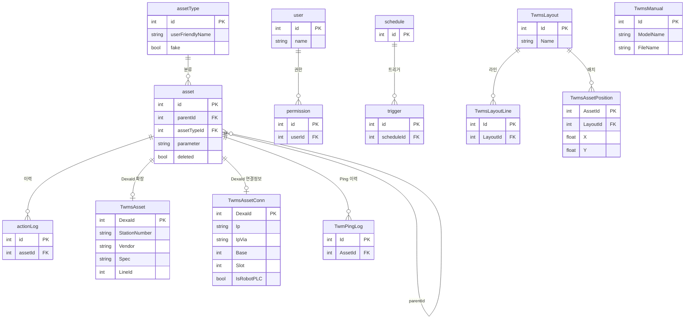

<div align="center">

# TWMS 2.0

**Total Workshop Management System**

종합설비관리 시스템

[](https://dotnet.microsoft.com/)
[](https://dotnet.microsoft.com/apps/aspnet/web-apps/blazor)
[](https://getakka.net/)
[](https://mudblazor.com/)
[](https://www.sqlite.org/)

---

*제조 라인의 설비 자산을 통합 관리·모니터링하는 웹 애플리케이션*
*DEXA 서버와 Akka.NET 원격 통신 및 DEXA SQLite DB 직접 조회로 연동하며,*
*정적 HTML+JS 페이지와 REST API(`/api/*`) 기반의 실시간 대시보드·레이아웃 시각화를 제공합니다.*
*(일부 관리 화면은 Blazor Server 페이지로 유지 — 정적 라우트 제거 시 즉시 폴백)*

</div>

---

## 주요 기능

| 기능 | 설명 |
|------|------|
| **대시보드** | KPI 카드·히트맵·차트 대시보드 및 통계 페이지 (ECharts·D3) |
| **자산 관리** | PLC·드라이브·로봇·서보 등 설비 자산 CRUD, 트리 탐색, 표 일괄 편집 |
| **레이아웃 시각화** | 도면 위 자산 배치·편집, 라인별 PLC 카드 뷰 (줌·팝오버) |
| **상태 모니터링** | 백업 상태(BACKEDUP/UNCHANGED/FAILED) 및 실시간 Ping 모니터링 |
| **스케줄/트리거** | Cron 기반 스케줄 관리 및 트리거 빌더 (매시간/매일/매주/매월) |
| **매뉴얼 관리** | 기종별 PDF 매뉴얼 업로드·다운로드 |
| **사용자 관리** | 사용자·권한 관리 (Admin 역할 기반) |
| **DB 관리** | TWM DB 백업·복원(내보내기/가져오기) 및 유지보수 |
| **mDNS 브로드캐스트** | `twms.local`로 네트워크 내 자동 검색 |

---

## 기술 스택

| 레이어 | 기술 | 용도 |
|--------|------|------|
| 런타임 | .NET 10.0 | 최신 .NET 런타임 |
| 액터 시스템 | Akka.NET 1.4.24 | DEXA 서버와 원격 메시징 |
| UI (기본) | 정적 HTML + Vanilla JS | canonical 페이지 (`wwwroot/app/*.html`), REST API 폴링 |
| UI (폴백) | Blazor Server + MudBlazor 8.15.0 | 일부 관리 화면(Blazor 레이아웃 편집기 등) 및 정적 라우트 폴백 |
| API | ASP.NET Core 컨트롤러 | `/api/*` REST 엔드포인트 (쿠키 인증, Admin 역할) |
| 데이터베이스 | SQLite + Dapper | 경량 ORM 기반 데이터 접근 |
| 시각화 | ECharts, D3 | 차트·그래프·대시보드 |
| 폰트 | Inter + Noto Sans KR (self-host) | 전체 UI 폰트 스택 (`wwwroot/lib/fonts/`) |
| 설정 | HOCON, appsettings.json | 계층적 설정 관리 |
| 네이티브 | C++ DLL (DeepPinger) | PLC 경유 네트워크 Ping |
| 언어 | F#, C#, C++, JavaScript | 타입 안전 백엔드 + 정적 UI + 네이티브 성능 |

---

## 프로젝트 구조

```
Twms2.0/
├── src/
│   ├── Twms2.Dexa/                # F# — DEXA 클라이언트 라이브러리 (CommProxy in-process)
│   │   ├── Messages/              #   C2S, S2C, A2S 메시지 정의
│   │   ├── Models/                #   Asset, User, Schedule 등 도메인 모델
│   │   ├── Utilities/             #   mDNS, 에러 처리
│   │   ├── DexaDirectClient.fs    #   메인 클라이언트 (초기화, 재연결)
│   │   └── IDexaClient.fs         #   C# 인터옵용 인터페이스
│   │
│   ├── Twms2.Server/              # C# — 정적 페이지 + REST API + Blazor 폴백 웹 애플리케이션
│   │   ├── Controllers/           #   /api/* REST 컨트롤러 (auth, assets, dashboard, admin, ...)
│   │   ├── Components/
│   │   │   ├── Pages/             #   Blazor 폴백 페이지 (Home, LayoutEditor, ...)
│   │   │   ├── Layout/            #   MainLayout, NavMenu
│   │   │   └── Shared/            #   재사용 컴포넌트
│   │   ├── Services/              #   비즈니스 로직 서비스
│   │   ├── Models/
│   │   │   ├── Dexa/              #   DEXA 도메인 모델 (ViewAsset, Action, ...)
│   │   │   ├── Twm/               #   TWM 로컬 모델 (Layout, Conn, Manual, ...)
│   │   │   └── Dashboard/         #   대시보드 모델
│   │   ├── Data/                  #   DB 연결 팩토리, 초기화
│   │   ├── HOCON/                 #   HOCON 파라미터 파싱
│   │   ├── wwwroot/
│   │   │   ├── app/               #   정적 canonical 페이지 (*.html + JS)
│   │   │   └── lib/               #   self-host 라이브러리 (ECharts, D3, 폰트 등)
│   │   ├── Program.cs             #   앱 진입점, DI 구성, 정적 라우트 매핑
│   │   └── appsettings.json       #   애플리케이션 설정
│   │
│   ├── DeepPinger/                # C++ — 네이티브 Ping DLL 소스 (x64)
│   ├── DeepPingerTest/            # C# — DeepPinger 테스트 앱 (WinForms)
│   ├── libs/                      # 미리 빌드된 DeepPinger.dll (빌드 시 출력 폴더로 복사)
│   └── Twms2.slnx                 # 솔루션 파일
│
├── installer/                     # 인스톨러 관련 파일
│   ├── twms2.0-setup.iss          #   InnoSetup 스크립트 (버전은 게시된 exe에서 자동 취득)
│   ├── setup-https.ps1            #   HTTPS 인증서 설정 스크립트
│   ├── redist/                    #   vc_redist.x64.exe (빌드 시 자동 다운로드, git 미추적)
│   └── output/                    #   빌드된 설치파일 출력 디렉토리
│
└── build-installer.bat            # 인스톨러 빌드 스크립트 (publish + 패키징)
```

---

## 페이지 구성

모든 canonical 라우트는 `wwwroot/app/*.html` 정적 페이지로 서빙됩니다
([Program.cs](src/Twms2.Server/Program.cs)의 미들웨어 매핑 — 항목을 지우면 동일 경로의 Blazor 페이지로 즉시 폴백).



> `/admin/layout/{id}` (Blazor 레이아웃 편집기)는 폴백으로 함께 유지됩니다. `/login`도 정적 페이지입니다.
> `/admin/*` 및 자산 편집 API는 쿠키 인증 + Admin 역할이 필요합니다.

---

## 아키텍처



---

## 데이터베이스

### DEXA DB (읽기 전용 — 외부)
DEXA 서버가 관리하는 SQLite 데이터베이스입니다. 경로: `C:\ProgramData\LS\DEXA\Storage\DEXA.sqlite3`

### TWM DB (읽기/쓰기 — 로컬)
TWMS 고유 데이터를 저장하는 로컬 SQLite입니다. 앱 시작 시 자동 생성·마이그레이션됩니다. 경로: `C:\ProgramData\DualSoft\TWMS2\twm.db.sqlite3`



---

## 런타임 데이터 경로

설치 후 런타임 데이터는 `C:\ProgramData\DualSoft\TWMS2\` 하위에 저장됩니다.

```
C:\ProgramData\DualSoft\TWMS2\
├── twm.db.sqlite3        # TWM 로컬 데이터베이스
├── appsettings.json      # 런타임 설정 (UI에서 편집 가능)
├── certificate.pfx       # HTTPS 자체서명 인증서 (설치 시 HTTPS 구성요소 선택 시)
├── manuals/              # 기종별 PDF 매뉴얼 파일
└── uploads/              # 업로드 파일 (도면 이미지 등)
```

---

## 설정

설정은 두 레이어로 로드됩니다:

1. 앱 폴더의 `appsettings.json` — 기본값 (배포 시 최소 구성)
2. `C:\ProgramData\DualSoft\TWMS2\appsettings.json` — 런타임 오버라이드 (UI에서 편집, 업그레이드 시 보존)

주요 항목:

```jsonc
{
  "App": {
    "Title": "종합설비관리",              // 앱 타이틀 (배포 환경에 맞게 변경)
    "ShowDate": true,
    "LogoPadding": 13
  },
  "DexaServer": {
    "ServerIp": "YOUR_SERVER_HOST",     // DEXA 서버 주소
    "ServerPort": 50001,                // Akka Remote 포트
    "AskTimeoutSeconds": 30,
    "PingTimeoutSeconds": 5,
    "ClientName": "twm-web"
  },
  "DexaDb": {
    "ConnectionString": "Data Source=C:\\ProgramData\\LS\\DEXA\\Storage\\DEXA.sqlite3;"
  },
  "TwmDb": {
    "ConnectionString": "Data Source=C:\\ProgramData\\DualSoft\\TWMS2\\twm.db.sqlite3;"
  },
  "PingSchedule": {
    "IntervalMinutes": 5,               // Ping 주기 (분)
    "Phase1MaxConcurrency": 10          // 동시 Ping 수
  },
  "Mdns": {
    "Hostname": "twms",                 // mDNS 호스트명 (twms.local)
    "Enabled": true
  },
  "Maintenance": {
    "PingLogRetentionDays": 365,        // Ping 이력 보존 일수 (0 이하 = 무제한)
    "ImportTempMaxAgeHours": 24         // DB 가져오기 임시파일 보존 시간
  },
  "Kestrel": {
    "Endpoints": {
      "Http": { "Url": "http://0.0.0.0:80" }
    }
  }
}
```

---

## 빌드 및 실행

### 사전 요구 사항

- [.NET 10.0 SDK](https://dotnet.microsoft.com/download)
- (선택) Visual Studio 2022+ C++ 빌드 도구 — `src/DeepPinger` C++ 소스를 수정할 때만 필요

### 개발 빌드

```bash
cd src
dotnet build Twms2.slnx
```

> DeepPinger(C++ DLL)는 미리 빌드된 `src/libs/DeepPinger.dll`을 MSBuild 타겟(`CopyDeepPinger`)이
> 출력 폴더로 복사합니다. C++ 소스를 수정한 경우에만 `src/DeepPinger`를 Release|x64로 재빌드해
> `src/libs/DeepPinger.dll`을 교체하세요.

### 실행

```bash
dotnet run --project src/Twms2.Server
```

브라우저에서 `http://localhost` 또는 `http://twms.local` (mDNS 활성화 시)로 접속합니다.

---

## 인스톨러 빌드

`build-installer.bat`를 실행하면 전체 빌드부터 설치파일 생성까지 자동 수행됩니다.

### 버전 관리

제품 버전의 **단일 출처**는 [Twms2.Server.csproj](src/Twms2.Server/Twms2.Server.csproj)의 `<Version>`입니다 (현재 **2.0.1**).
인스톨러 스크립트는 게시된 `Twms2.Server.exe`의 ProductVersion을 읽어 설치파일명과 `AppVersion`에 자동 반영하므로,
릴리스 시 csproj의 `<Version>`만 올리고 `build-installer.bat`를 실행하면 됩니다.

### 사전 요구 사항

| 도구 | 용도 | 비고 |
|------|------|------|
| .NET 10.0 SDK | C#/F# 프로젝트 빌드 | `dotnet` CLI 사용 |
| [InnoSetup 6](https://jrsoftware.org/isinfo.php) | 설치파일(.exe) 생성 | 기본 경로(`C:\Program Files (x86)\Inno Setup 6`) 설치 필요 |
| vc_redist.x64.exe | VC++ 런타임 재배포 패키지 | 빌드 시 `installer/redist/`에 자동 다운로드(인터넷 필요). 오프라인 빌드 PC는 수동 배치 |

> DeepPinger는 저장소에 포함된 미리 빌드된 DLL(`src/libs/DeepPinger.dll`)을 사용하므로
> C++ 빌드 도구는 필요하지 않습니다.

### 빌드 과정

```bash
build-installer.bat
```

스크립트가 수행하는 단계:

1. **VC++ 재배포 패키지 확보** — `installer/redist/vc_redist.x64.exe`가 없으면 자동 다운로드
2. **Clean** — 이전 publish 출력 정리
3. **dotnet publish** — `win-x64` self-contained 배포 패키지 생성
4. **DLL 복사** — `src/libs/DeepPinger.dll`을 publish 출력에 복사
5. **InnoSetup 컴파일** — `installer/twms2.0-setup.iss` → `installer/output/Twms2.0-Setup-{version}.exe`

> vc_redist 다운로드 실패 시 빌드가 중단됩니다(오프라인 강제 빌드는 `SKIP_VCREDIST=1`).

빌드 완료 후 `installer/output/` 디렉토리에 설치파일이 생성됩니다.

### 인스톨러 포함 사항

- TWMS 2.0 애플리케이션 (self-contained, .NET 런타임 포함)
- DeepPinger.dll (네이티브 PLC Ping)
- Windows 서비스 등록 (`twms2.0`, 지연 자동 시작)
- 방화벽 규칙 자동 추가 (HTTP 80, HTTPS 443)
- ProgramData 디렉토리 자동 생성
- HTTPS 설정 (선택 구성요소, `setup-https.ps1`)
- VC++ 런타임 재배포 패키지 (`vc_redist.x64.exe`, 대상 PC에 미설치 시 자동 설치 → 오프라인 설치 보장)

---

## Windows 서비스 배포

인스톨러로 설치하면 **Windows 서비스**로 자동 등록됩니다.

| 항목 | 값 |
|------|-----|
| 서비스 이름 | `twms2.0` |
| 표시 이름 | `TWMS 2.0 Web Server` |
| 시작 유형 | 지연 자동 시작 (`delayed-auto`) |
| 실패 복구 | 10초 → 30초 → 60초 후 재시작, 리셋 주기: 1일 |
| 설치 경로 | `C:\Program Files\Twms2.0\` |

서비스 관리 명령:

```bash
# 서비스 상태 확인
sc query twms2.0

# 서비스 중지/시작
sc stop twms2.0
sc start twms2.0
```

---

## 백그라운드 서비스

| 서비스 | 설명 |
|--------|------|
| **PingBackgroundService** | 5분 주기로 전체 자산 Ping 상태 확인 (ICMP + DeepPinger) |
| **MaintenanceBackgroundService** | 일일 유지보수 — Ping 이력 보존 기간 정리, DB 가져오기 임시파일 정리 |
| **MdnsHostedService** | `twms.local` mDNS 브로드캐스트 |
| **캐시 워밍** | 시작 후 백그라운드로 자산·액션·에이전트 데이터 사전 로드 |

---

## API 엔드포인트

정적 페이지가 사용하는 REST API는 `/api/*` 컨트롤러로 제공됩니다 (주요 프리픽스):

| 프리픽스 | 설명 |
|----------|------|
| `/api/auth` | 로그인·로그아웃·세션 확인 |
| `/api/nav` | 네비게이션·공통 셸 데이터 |
| `/api/dashboard` | 대시보드 KPI·차트 데이터 |
| `/api/assets`, `/api/assets/table` | 자산 조회·편집, 표 일괄 편집 |
| `/api/layout` | 레이아웃 조회 (뷰어) |
| `/api/history` | 액션·백업 이력 |
| `/api/schedules` | 스케줄·트리거 |
| `/api/status` | 실시간 상태 모니터링 |
| `/api/statistics` | 통계 |
| `/api/settings` | 설정 (일반·라인·매뉴얼) |
| `/api/admin/config`, `/api/admin/users`, `/api/admin/database`, `/api/admin/layout` | 관리자 API (Admin 역할 필요) |

기타 엔드포인트:

| 메서드 | 경로 | 설명 |
|--------|------|------|
| GET | `/api/download/backup/{assetId}/{version}` | 백업 ZIP 다운로드 |
| Static | `/report/*` | DEXA 리포트 파일 서빙 |
| Static | `/uploads/*` | 업로드 파일 서빙 |
| Static | `/manuals/*` | PDF 매뉴얼 파일 서빙 |

---

## 라이선스

Private — 내부 사용 전용
